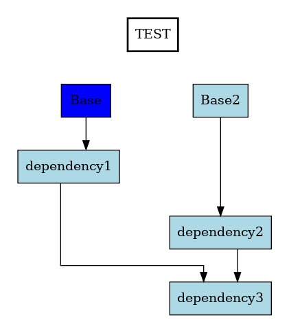

# DependenViz

This executable reads an input file in a simple DSL and,
using the graphviz (https://gitlab.com/daniel-casanueva/haskell/graphviz) bindings,
outputs a visualisation of the specified dependency trees

## Installation

DependenViz requires a Graphviz installation for it to work.  
Link to the [Graphviz installation page](https://graphviz.org/download/)

It also requires GHC version 9.8.x, and Cabal 3.x.x

To build it run `cabal build`, then `cabal run dependenViz -- [input] (OPTIONS)`

To install DependenViz on your system run `cabal install .` in the project folder

## Usage

```
dependenViz FILENAME [-o|--output File] [-t|--type Extension]

Available options:
  FILENAME                 Name of the file to process
  -o,--output File         Optional name of output file. Default (FILENAME)
  -t,--type Extension      Optional extension of output file. Default 'png'
  -h,--help                Show this help text
```

Example input file in the DependenViz language

docs/prueba.dvz

```
(TEST; color: all only LightBlue)

Base {
    -- comments start with '--'
    rank: 1,
    -- optional
    color: Blue,
}

Base2 { }

dependency1 {
    depends: [Base],
}

dependency2 {
    rank: 3,
    depends: [Base2]
}

dependency3 {
    depends: [dependency1, dependency2]
}
```

When called with `cabal run dependenViz -- docs/prueba.dvz -o output`,
or with `dependenViz prueba.dvz -o output` after installing with `cabal install .`, this outputs

output.png



## How to define a dependency tree

This is a simplification of the language. For the full thing go to src/Parse.y

```
[ '(' Project configuration ')' ] Nodes
```

#### Project configuration

NAME is an alphanumeric string that has to start with an alphabetic value.  
'options' is a comma separated list of project attributes.  
Colors is a comma separated list of 'X11Color's.  

```
NAME; [options] | NAME | [options]

NAME -> [a-z | A-Z].[a-z | A-Z | 0-9].*

option -> name: NAME | color: colorRange

colorRange -> all colorType | clusters colorType

colorType -> random | only X11Color | fromList Colors
```

#### Node

A node consists of a name and a comma separated list (with an optional final comma) of attributes.

```
NAME '{' [Attributes] '}'

Attribute -> rank: NaturalNumber | color: X11Color | depends: [NAMES]

NaturalNumber -> 1 | 2 | ...
```

